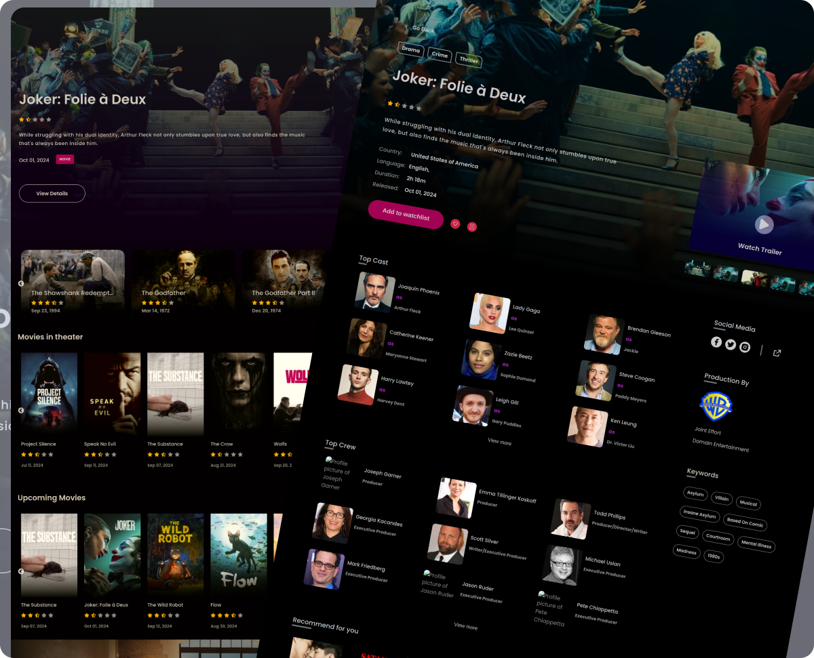

# Pyxis

Pyxis is a simple website where users can view details about movies and TV shows.



## Features
- Browse info's about Movie & Tv Shows.
- Make library or collection of movies/tv shows.

## Technologies used 

- 
- 
- 
- 
- 
- 
- 
- 
- 

## API
[TMDB] -  provide movie & tv show details

## Installation

1. Clone the repo
   ```sh
   git clone https://github.com/Ashik-AD/pyxis.git
   ```
2. Install NPM packages
   ```sh
   cd server 
   npm install
   cd ..
   cd frontend
   npm install
   cd ..
   npm install
   ```
3. Start local dev
   ```sh
   npm start
   ```
